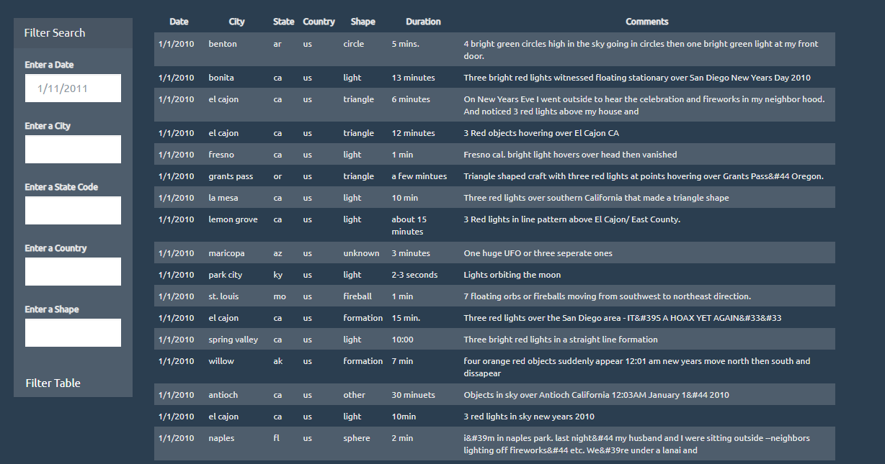

# javascript-challenge - Aliens R Real!

## Background

WAKE UP SHEEPLE! The extra-terrestrial menace has come to Earth and we here at `ALIENS-R-REAL` have collected all of the eye-witness reports we could to prove it! All we need to do now is put this information online for the world to see and then the matter will finally be put to rest.

There is just one tiny problem though... our collection is too large to search through manually. Even our most dedicated followers are complaining that they are having trouble locating specific reports in this mess.

That's why we writing code that will create a table dynamically based upon a [dataset we provide](StarterCode/static/js/data.js). We also need to allow our users to filter the table data for specific values. 

We can handle this... right? The planet Earth needs to know what we have found!

## Task

### Automatic Table and Date Search

* Created a basic HTML web page or use the [index.html](StarterCode/index.html) file provided.

* Used the UFO dataset provided in the form of an array of JavaScript objects to write code that appends a table to the web page and then adds new rows of data for each UFO sighting.

* Used a date form in the HTML document and wrote JavaScript code that listens for `onchange` events and searches through the `date/time` column to find rows that match user input.

* Used multiple `input` tags and/or select dropdowns, wrote JavaScript code so the user can to set multiple filters and search for UFO sightings using the following criteria based on the table columns:

  1. `date/time`
  2. `city`
  3. `state`
  4. `country`
  5. `shape`

- - -

### Dataset

* [UFO Sightings Data](StarterCode/static/js/data.js)

- - -

### Succes???

- - -

